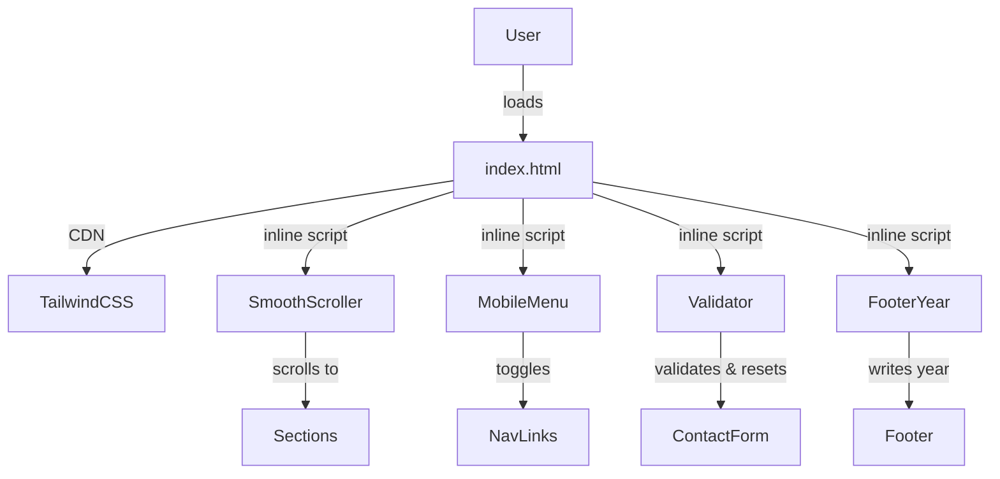

# Design Document

## Overview

A single-page website built with HTML5, Tailwind CSS (CDN), and Vanilla JS. The page is self-contained in one HTML file with inline `<script>` and `<style>` blocks (or a companion `main.js`). No build tooling is required.

The site has five visible sections rendered in order: Nav, Hero, Features, Contact Form, and Footer. JavaScript modules handle three interactive concerns: smooth scrolling, mobile menu toggling, and contact form validation.

## Architecture

The site is a static single-page application with no server-side rendering or bundler.

```
index.html
├── <head>          — meta tags, Tailwind CDN link, page title
├── <header>        — Nav (logo + links + hamburger)
├── <main>
│   ├── <section id="hero">     — Hero section
│   ├── <section id="features"> — Features section
│   └── <section id="contact">  — Contact form
├── <footer>        — Copyright notice (year injected by JS)
└── <script>        — SmoothScroller, MobileMenu, Validator, FooterYear modules
```

All JavaScript runs after DOM content is loaded. No external JS libraries are used.



## Components and Interfaces

### SmoothScroller

Attaches `click` listeners to all `<a href="#...">` anchor links. On click, calls `element.scrollIntoView({ behavior: 'smooth' })` and cancels the default jump. Animation completes within 600ms (browser-native smooth scroll).

```
SmoothScroller.init() → void
  - Queries all [data-scroll-target] or href="#..." anchors
  - Adds click handler: preventDefault + scrollIntoView smooth
```

### MobileMenu

Manages the hamburger button and the collapsible nav link list.

```
MobileMenu.init() → void
  - Queries #hamburger button and #nav-links container
  - On click: toggles hidden class on #nav-links
  - On click: toggles aria-expanded attribute on #hamburger
```

### Validator

Validates the contact form on submit. Checks required fields and email format.

```
Validator.init() → void
  - Queries #contact-form
  - On submit: runs validateAll()
    - validateRequired(field) → boolean
    - validateEmail(field) → boolean
  - Shows inline error spans adjacent to invalid fields
  - On all-pass: shows success message, calls form.reset()
```

### FooterYear

Writes the current year into the footer copyright element.

```
FooterYear.init() → void
  - Queries #copyright-year span
  - Sets textContent to new Date().getFullYear()
```

## Data Models

The site has no persistent data store. The only runtime state is:

| State      | Owner      | Type                 | Description                                     |
| ---------- | ---------- | -------------------- | ----------------------------------------------- |
| menuOpen   | MobileMenu | boolean              | Whether the mobile nav is currently visible     |
| formErrors | Validator  | Map<fieldId, string> | Current inline error messages keyed by field id |

### Contact Form Fields

| Field   | HTML type | Required | Validation rule                 |
| ------- | --------- | -------- | ------------------------------- |
| name    | text      | yes      | non-empty after trim            |
| email   | email     | yes      | non-empty + matches email regex |
| message | textarea  | yes      | non-empty after trim            |

Email validation regex: `/^[^\s@]+@[^\s@]+\.[^\s@]+$/`

## Correctness Properties

_A property is a characteristic or behavior that should hold true across all valid executions of a system — essentially, a formal statement about what the system should do. Properties serve as the bridge between human-readable specifications and machine-verifiable correctness guarantees._

### Property 1: Smooth scroll targets correct section

_For any_ anchor link on the page with a valid `href="#<id>"` target, clicking it should invoke `scrollIntoView({ behavior: 'smooth' })` on the element matching that id, and the default navigation jump should be prevented.

**Validates: Requirements 2.3, 3.3**

### Property 2: Mobile menu toggle is consistent

_For any_ initial state of the mobile menu (open or closed), clicking the hamburger button should toggle the nav links to the opposite visibility state AND update the `aria-expanded` attribute on the hamburger button to the corresponding boolean string (`"true"` or `"false"`). Clicking twice should return both to their original values.

**Validates: Requirements 2.5, 7.4**

### Property 3: Form validation rejects invalid input

_For any_ form submission where at least one required field is empty (after trimming whitespace) or the email field contains a string that does not match the email regex, the Validator SHALL prevent form submission and display at least one inline error message. No success message shall appear.

**Validates: Requirements 5.2, 5.3**

### Property 4: Valid form submission resets state

_For any_ form submission where name is non-empty (after trim), email matches the valid email regex, and message is non-empty (after trim), the Validator SHALL display a success message and all form fields SHALL be empty after the reset.

**Validates: Requirements 5.4**

## Error Handling

| Scenario                                | Behavior                                                   |
| --------------------------------------- | ---------------------------------------------------------- |
| Required field empty on submit          | Validator shows inline error, blocks submit                |
| Email field has invalid format          | Validator shows inline error, blocks submit                |
| Anchor href target not found in DOM     | SmoothScroller silently skips (no scroll, no error thrown) |
| FooterYear span not found in DOM        | FooterYear logs a warning and exits gracefully             |
| Hamburger button or nav-links not found | MobileMenu logs a warning and exits gracefully             |

All JS modules guard against missing DOM elements with a null check before attaching event listeners.

## Testing Strategy

This feature is a static HTML/JS page. The testing approach uses:

- **Example-based unit tests** for structural and DOM checks (most requirements)
- **Property-based tests** for the four correctness properties above (using [fast-check](https://github.com/dubzzz/fast-check) for JavaScript)

### Unit Tests (Example-Based)

Cover structural requirements that don't vary with input:

- HTML document structure: DOCTYPE, semantic elements, viewport meta, Tailwind CDN link
- Nav DOM structure: logo, links, hamburger button with aria-label
- Hero DOM structure: headline, paragraph, CTA button
- Features section: minimum 3 cards each with icon, title, description; responsive grid classes present
- Contact form: all fields present with matching label for/id pairs
- Footer: copyright text and current year present
- Responsive CSS classes present on key layout elements

### Property-Based Tests (fast-check)

Each property test runs a minimum of 100 iterations.

**Property 1 — Smooth scroll targets correct section**

- Generator: random selection from the set of valid anchor hrefs on the page
- Verify: `scrollIntoView` called with `{ behavior: 'smooth' }` on the correct element; `preventDefault` called
- Tag: `Feature: simple-website, Property 1: smooth scroll targets correct section`

**Property 2 — Mobile menu toggle is consistent**

- Generator: random initial state (open/closed), random number of clicks (1–10)
- Verify: after N clicks, visibility and aria-expanded match expected parity; two clicks always returns to original state
- Tag: `Feature: simple-website, Property 2: mobile menu toggle is consistent`

**Property 3 — Form validation rejects invalid input**

- Generator: random strings for name/email/message where at least one field is empty or email is invalid
- Verify: submit is prevented, at least one error element is visible, no success message shown
- Tag: `Feature: simple-website, Property 3: form validation rejects invalid input`

**Property 4 — Valid form submission resets state**

- Generator: random non-empty name, valid email (matching regex), non-empty message
- Verify: success message visible, all field values are empty string after reset
- Tag: `Feature: simple-website, Property 4: valid form submission resets state`
